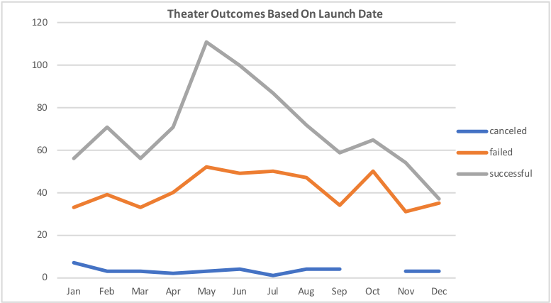
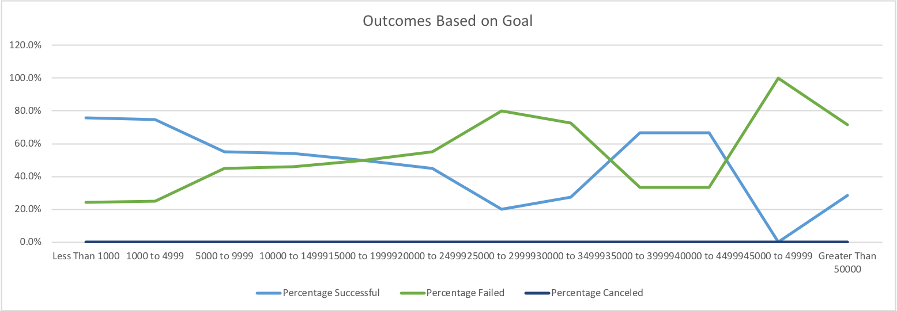

# Kickstarting with Excel

### Overview of Project
Our client Louise wants to know how campaigns similar to hers have fared trend-wise in relation to their respective launch dates and funding goals. 
### Project Purpose & Background
The purpose of this report is to analyze Kickstarter data to discover trends and produce a detailed perspective on how different variables may affect certain outcomes for our client in the future. Charts and graphs will be used to convey these findings to the client. These charts and graphs will aid in telling the complete story on how we arrived at our findings and how they can be of use to the client in their future endeavors.

### Analysis and Challenges
To effectively arrive at our conclusions, outcomes in relation to various campaign launch dates were analyzed and visualized in the form of charts to convey potential trends to the client. Issues regarding a lack of data for the month of October and the canceled campaigns for that month were encountered. In the future, sourced data needs to be cleaned and gathered more efficiently to populate all columns and fields for us to deliver better solutions to the client.
#### Analysis of Outcomes Based on Launch Dates & Outcomes Based on Goals

## Results
One conclusion that we have arrived at after analyzing our data is that theater campaigns that are launched in Q2 are more successful than ones launched in Q4. Another conclusion is that there is a slight inverse correlation between the success and failure of theater campaigns launched between the months of May and June. This strengthens our initial finding that launching a campaign in May and June are the best options for the client.

By observing the “Outcomes Based on Goals” chart we can see that there was a higher success rate with campaigns that had a funding goal of $1,000 to $25,000. From this analysis combined with those in our previous chart we can begin to believe that campaigns launched during the months of May and June with a funding goal target of between $1,000 to $25,000 will have a higher chance for success.

Some limitations that this particular data set carries are that the data may require updating due to the data being from an older timeframe. An additional graph that we can create would be “Gender of Campaign Backers” to determine whether pitching campaigns to specific genders yields more success for our endeavor.

* Note: All images that are screen shots are mine. All other photos are sources from Google Images.
